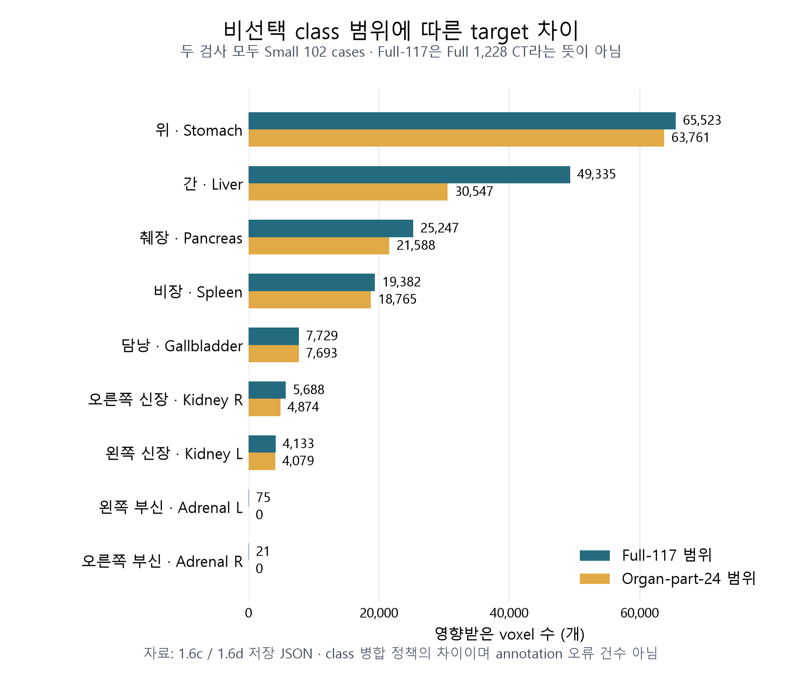
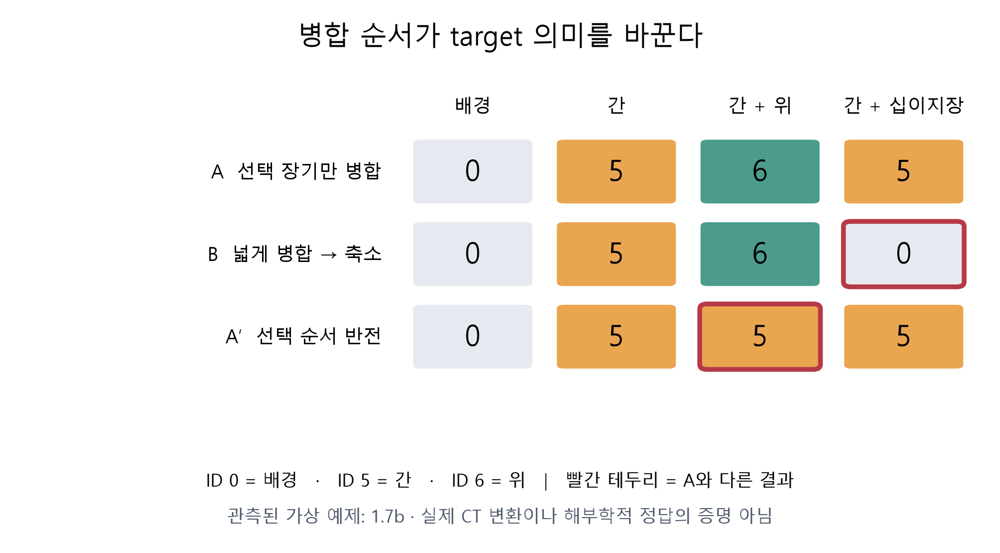

# OLES3D 연구 복습서

3D 복부 CT 분할 연구를 위한 데이터 이해·검증·설계 기록

박용민 · 마벨러스 | 경기대학교 컴퓨터공학전공 3학년

2026년 9월 13일 판 · Prerequisite → Phase 1.7b

AI 보조로 작성하고 코드·산출물과 대조한 교육용 연구 기록. 학술대회 제출 논문이나 임상 지침이 아님.

## 01. 이 책의 범위와 읽는 방법

### 현재 어디까지 왔는가

**우리는 아직 OLES3D 모델 성능을 얻지 않았다. 지금까지의 핵심은 “무엇을 정답으로 삼고 어떤 데이터로 공정하게 비교할 것인가”를 정리한 것이다.** 데이터 검증은 필요한 연구 기반이지만, 새로운 segmentation 알고리즘의 성능 증거는 아니다.

Prerequisite 20개 lesson을 종료했고, Small의 무결성·geometry·mask coverage·overlap을 조사했다. Small/Full의 metadata 관계를 확인했으며 선택 9장기 병합 규칙 A를 선택했다. 다음은 **1.7c Full 1,228개 병합 coverage**와 **1.7d cohort·split manifest**다.

> 혼동 방지: 1.6c의 **full-117**은 “117개 class 범위”다. 이 검사는 **Small 102 cases**에서 완료됐다. **Full 1,228 cases**를 검사하는 1.7c와 다르다.

### 증거 상태를 읽는 네 가지 표기

| 표기 | 의미 | 사례 |
| --- | --- | --- |
| 현재 산출물 확인 | TXT/JSON/노트북을 이번 편집에서 직접 확인 | 1.6c: 102 cases, audit_complete=true |
| 과거 수행 기록 | 이전 실행 이력은 있으나 현재 전용 결과 파일 없음 | 1.2·1.2b 해제 CRC, 1.3 전용 TXT |
| 교육 예제 | 개념을 설명하는 작은 계산·가상 배열 | 네 voxel 병합, Dice 계산 |
| 선택 / 미검증 | 규칙 선택과 전체 실제 적용 완료를 구별 | Label A 선택, Full eligible ID 미확정 |

**파일 존재 → 프로그램 종료 → 검사 통과 → 연구 가설 검증**은 서로 다른 단계다. 완료 flag는 프로그램에 구현된 검사 범위만 보증한다.

현재 1.7c 최종 JSON과 1.7d manifest는 없다. 이전 중단 로그도 이번 편집 시 파일 목록에는 없었다. 따라서 과거 대화의 “로그 보존”을 현재 존재로 표현하지 않는다. 기록 유실과 연구 미수행은 같지 않지만, 현재 재현 근거가 부족한 항목은 표시한다.

### 학교에서 복습하는 세 경로

| 시간 | 읽을 범위 | 설명할 수 있어야 할 것 |
| --- | --- | --- |
| 15분 | 02·04·08장 핵심 표 | 연구 질문, dataset 범위, 다음 gate |
| 40분 | 05–07장 실제 감사 | Geometry PASS의 한계, merge가 target을 바꾸는 이유 |
| 90분 | 03장 → 05–08장 → 부록 문제 | Tensor에서 데이터 정책까지 연결 |

코드를 외우기보다 **입력 → 결정적인 연산 → 출력 → 해석의 한계**를 복기한다. CLI는 10장에 모았다. 복습 문제에는 바로 답과 해설을 실었다.

### 이번 판의 제작 범위

원본 CT·mask를 수정하지 않았고 장시간 감사를 다시 실행하지 않았다. 기존 산출물·코드를 읽고 도표와 PDF를 생성했다. 개인 상담 내용·타인 평가를 연구 문서에 넣지 않았다. 연구자의 독립 숙련이나 단독 기여율을 코드량으로 추정하지 않는다.

## 02. OLES3D가 답하려는 연구 질문

### 프로젝트의 목적 세 가지

1. **학술 성과:** KIIT 2026 추계 대학생논문경진대회 논문·발표를 완성하고 금상을 목표로 한다. 수상은 외부 심사 결과라 보장할 수 없다.
2. **학습:** 마벨러스가 데이터 가정, 실험 통제, 결과 해석을 직접 설명할 Medical AI 연구 역량을 축적한다.
3. **포트폴리오:** 단독저자로 책임지고 재현할 연구 기록·코드·논문을 남긴다. AI 작성과 본인 이해·검증의 범위를 구분한다.

저장소 확장명은 **Organ-wise Learning-State and Error-Type-Guided Adaptive Patch Sampling for 3D Abdominal CT Segmentation**이다. 핵심 질문은 “장기의 학습 상태·오류 유형에 따라 patch를 어디서 얼마나 뽑을 것인가”다. Learning-progress는 후보이며 독립 기여가 검증된 기능이 아니다.

현재 연구 방향을 직접 드러내는 제목은 **“장기별 오류 유형 기반 적응적 패치 샘플링을 이용한 3차원 복부 CT 분할”**이다. 최종 제목은 실제 구현·비교 결과보다 강한 주장을 담지 않아야 한다.

### 무엇을 고정하고 무엇을 바꾸는가

CT 전체 대신 작은 3D patch를 뽑아 학습한다. 같은 update 수라도 빈 배경만 자주 뽑는지, 어려운 장기 경계를 적절히 뽑는지에 따라 학습 신호가 달라질 수 있다.

| 고정할 요소 | 바꿀 요소 |
| --- | --- |
| Label·cohort·split, nnU-Net plan·network·loss·augmentation, 초기화·학습 예산 | Training patch-center 선택 정책 |

새 attention, Transformer backbone, loss를 동시에 추가하면 개선 원인이 모호해진다. 현재는 sampling에 집중한다.

### U-Net과 nnU-Net의 차이

**U-Net은 architecture 계열**이다. Encoder가 문맥을 압축하고 decoder가 해상도를 복원하며 skip은 고해상도 feature를 전달한다. **nnU-Net은 U-Net 기반 segmentation을 데이터에 맞춰 구성하는 framework**다. 전처리, spacing, patch·batch 크기, network, 학습·추론 규칙이 함께 작동한다. Pretrained model 한 파일이나 nn.Module 하나와 같지 않다. [U-Net 원논문](https://arxiv.org/abs/1505.04597), [nnU-Net 원안](https://arxiv.org/abs/1809.10486).

선택 이유는 “모든 모델보다 우월해서”가 아니라 강한 실용 기준선을 두고 sampling 효과를 분리하기 좋아서다. 교육용 U-Net 실행 성공은 실제 nnU-Net v2 baseline 검증과 다르다.

### 기본 foreground oversampling이 있는데 무엇을 더 하는가

Uniform center는 voxel 위치를 균등하게 고른다. Foreground-centered sampling은 label이 있는 위치를 중심으로 골라 장기 포함 patch를 더 자주 공급한다. 반드시 현재 모델의 오류를 반영하는 것은 아니다.

간을 이미 잘 분할해도 부신 경계는 계속 틀릴 수 있다. 후보 질문은 **어느 장기·어느 오류 유형에 sampling 자원을 더 줄 것인가**다. 어려운 곳만 뽑으면 잡음 label이나 풀기 어려운 부위에 지나치게 집중할 수도 있다.

공식 trainer의 기본 foreground 설정 0.33은 최종 patch의 정확히 33%만 장기를 포함한다는 뜻이 아니다. 기본 loader의 batch quota 반올림과 랜덤 patch의 장기 포함이 영향을 준다. 설명용 기본식 `sample_idx >= round(B × (1 − 0.33))`에서 B=2면 1개, B=1이면 강제 foreground가 0개일 수 있다.

이 설명은 공식 source revision `0b47823c2d5c80e9db62e838c56f79ba0622fa2e` 기준이며 OLES3D 설치·실험 검증은 아니다. 실제 B0에서는 버전·trainer·batch 설정을 확인한다. [Trainer](https://github.com/MIC-DKFZ/nnUNet/blob/0b47823c2d5c80e9db62e838c56f79ba0622fa2e/nnunetv2/training/nnUNetTrainer/nnUNetTrainer.py), [Loader](https://github.com/MIC-DKFZ/nnUNet/blob/0b47823c2d5c80e9db62e838c56f79ba0622fa2e/nnunetv2/training/dataloading/data_loader.py).

### 세 오류 유형

| 유형 | 장기 k에 대한 뜻 | Patch 선택 목적 |
| --- | --- | --- |
| Interior miss | 실제 장기 내부인데 k가 아닌 것으로 예측 | 내부 누락에 학습 신호 공급 |
| Boundary disagreement | 정의한 경계 band에서 예측·정답 불일치 | 장기와 주변 구조 구분 학습 |
| Exterior false positive | 실제 장기 바깥인데 k로 예측 | 주변 조직을 장기로 오인하는 문제 학습 |

아직 개념 설계다. Boundary 폭의 mm 규약, 범주가 겹칠 때 우선순위, 예측 갱신 주기는 protocol로 정해야 한다. 정답 자체가 불명확한 곳을 확정적인 모델 오류라고 부르면 잘못된 피드백이 생긴다.

### 적응 배분 식을 말로 읽기

$$
p_t(k,r)=(1-\epsilon)q(k,r)+\epsilon a_t(k,r)
$$

k는 장기, r은 오류 유형, t는 갱신 시점이다. q는 고정 분포, a는 최근 관측에 따라 바뀌는 분포다. 각각 유효한 후보 전체에서 합이 1이어야 한다. Epsilon=0은 고정 배분, 1은 적응 배분만 사용한다.

**교육 예제:** q=0.10, a=0.30, epsilon=0.25면 확률은 0.75×0.10+0.25×0.30=0.15다. 장기의 크기나 voxel segmentation 확률이 아니라 **그 후보 범주를 sampling할 확률**이다. 빈 후보·정규화·최소 탐색 확률은 별도 설계가 필요하다.

### 비교군과 주장 경계

| 방법 | 의미 | 질문 |
| --- | --- | --- |
| B0 | 기본 nnU-Net sampler | 실용 기본 방법보다 유용한가? |
| B1 | P와 같은 오류 후보 생성·갱신, 배분만 고정 | 동적 배분의 효과가 있는가? |
| P | 장기×오류 유형 adaptive 배분 | 제안 정책의 결과는 무엇인가? |
| 추가 adaptive 대조 | 오류 유형을 합쳐 장기별 점수만 사용 | 유형 구분 자체가 필요한가? |

B1도 오류 후보를 갱신한다면 관측 비용을 포함해야 한다. 고정 배분과 오류 map까지 영원히 고정하는 것은 다르다. 마지막 대조 없이 B0/B1/P만 비교했다면 유형 분해의 개별 기여를 강하게 주장하기 어렵다.

**현재 novelty 판정:** 단순 reproduction으로 끝내려는 기획은 아니다. 그러나 adaptive sampling 자체는 새 아이디어가 아니다. 좁고 검증 가능한 후보 기여를 실제 통제 실험·비용 분석으로 입증해야 하는 단계다. 데이터 감사는 sampler의 성능 결과가 아니다.

## 03. Prerequisite를 연구에 연결하기

### 과정 종료와 실행 증거

20개 notebook·111개 non-empty code cell을 보유한다. 저장된 exception output은 0개지만 Part 1–3의 9개 cell에는 execution count가 없다. 종료 당시 7개 notebook의 41개 cell을 fresh kernel에서 순차 검증했다는 기록이 있고, 나머지 전체를 이번 제작에서 재실행하지 않았다.

| Part | 종료한 lesson | 연구에서 사용할 판단 |
| --- | --- | --- |
| 1 | Tensor contract / Softmax·CE / Dice·IoU | 모델 입출력·정답·평가 대상 구분 |
| 2 | Convolution·receptive field / Encoder–decoder·skip / Tiny overfit | Shape 추적과 학습 pipeline 점검 |
| 3 | Conv3D·memory / Crop·padding·sampling / Sliding window | 메모리 제한에서 학습·추론 |
| 4 | NIfTI·affine / Orientation / Resampling / CT HU·anatomy | 배열과 물리 공간 연결 |
| 5 | CE+Soft Dice / NSD·HD95 / Empty·aggregation | Loss·metric·예외·집계 규약 |
| 6 | Fingerprint·plans / Foreground sampling / Deep supervision·predictor | Framework 책임과 변경 지점 구분 |
| 7 | Split·leakage·reproducibility | 독립성·재현성 |

7.2 paired evaluation·bootstrap은 Phase 5 실제 분석으로 이관했다. 연구에서 통계적 불확실성을 생략한다는 뜻이 아니다.

### 3.1 Tensor contract

| 대상 | Shape | dtype | 값의 의미 |
| --- | --- | --- | --- |
| CT input | [B,1,D,H,W] | float32 등 | 전처리된 intensity |
| Logits | [B,10,D,H,W] | floating point | 각 voxel의 10개 class 점수 |
| Target | [B,D,H,W] | torch.long | 정답 class ID 하나 |
| Prediction | [B,D,H,W] | torch.long | argmax로 선택한 ID 하나 |

Logit은 확률이 아니다. Softmax로 class 축 합이 1인 확률로 변환할 수 있다. Multi-class prediction은 voxel당 ID 하나다. `argmax(dim=1)`은 class 축을 제거한다. Dim=2인 D축을 제거하면 공간을 잘못 줄인다. 동점이면 PyTorch argmax는 첫 최대 위치를 반환한다.

```python
def predict_class_ids(
    logits: torch.Tensor,  # [B,K,D,H,W], floating point
) -> torch.Tensor:         # [B,D,H,W], torch.long
    """각 voxel에서 가장 큰 logit의 class ID 선택"""

    # 위치는 유지하고 class 축에서 ID 하나 선택
    return logits.argmax(dim=1)
```

이 발췌는 import를 생략한 설명용 함수다. 독립 실행은 해당 notebook의 Cell 0부터 수행한다.

### 3.2 Softmax·CE·Soft Dice

$$
p_k=\frac{\exp(z_k-m)}{\sum_j\exp(z_j-m)},\qquad m=\max_j z_j
$$

최댓값을 빼는 이유는 exp의 overflow를 줄이기 위해서다. 같은 수를 빼도 확률 비율은 같다. CE는 정답 class 확률을 높이도록 학습시킨다.

$$
L_{\mathrm{CE}}=-\frac{1}{V}\sum_{v=1}^{V}\log p_{v,y_v}
$$

V는 집계 voxel 수다. CrossEntropyLoss에는 보통 softmax 전 logits와 정수 target을 넣는다. 이미 softmax한 값을 다시 logits처럼 넣으면 다른 계산이 된다.

$$
D_k^{\mathrm{soft}}=\frac{2\sum_v p_{v,k}y_{v,k}+\delta}{\sum_v p_{v,k}+\sum_v y_{v,k}+\delta}
$$

y는 one-hot indicator, delta는 smoothing 값이다. Argmax로 굳히지 않은 확률을 사용하므로 gradient가 흐른다. 배경 포함, batch/class 집계 축, smoothing 위치는 구현별로 다르다. 연구에서는 nnU-Net loss를 먼저 유지한다. 교육용 CE+Dice를 별도 novelty로 추가하지 않는다.

### 3.3 TP·FP·FN과 overlap metric

| 한 장기 k 기준 | 정답 k | 정답이 k 아님 |
| --- | --- | --- |
| 예측 k | TP: 맞힌 장기 voxel | FP: 장기로 잘못 예측 |
| 예측이 k 아님 | FN: 놓친 장기 voxel | TN: 장기가 아닌 것으로 맞힘 |

$$
\mathrm{Dice}=\frac{2TP}{2TP+FP+FN},\qquad \mathrm{IoU}=\frac{TP}{TP+FP+FN}
$$

교육 예제 TP=80, FP=20, FN=40이면 Dice≈0.727, IoU≈0.571이다. Background가 95%인 영상에서 전부 background를 예측하면 accuracy는 95%지만 장기 Dice는 0일 수 있다.

### 3.4 Encoder·decoder·skip과 tiny overfit

`MaxPool3d(2)`는 [1,16,32,64,64]를 [1,16,16,32,32]로 바꾼다. Channel 16은 그대로이고 공간 세 축이 절반이다. Skip은 pooling 전 고해상도 feature를 전달해 위치·경계 세부 정보 복원을 돕는다. Concatenation은 channel을 합치므로 공간 shape를 먼저 맞춘다.

Tiny overfit은 작은 고정 training sample에서 loss 감소·Dice 증가를 보는 점검이다. 입력·정답 대응, gradient, optimizer 등의 큰 결함을 찾는다. 새로운 환자의 일반화나 임상 유용성을 보증하지 않는다.

### 3.5 FP32와 GPU memory

FP32의 FP는 floating point다. 앞의 false positive와 다르다. 원소 하나는 4 bytes다.

$$
M_{\mathrm{raw}}=\frac{B C D H W \times b}{1024^2}\ \mathrm{MiB}
$$

b는 원소당 byte 수다. [1,16,32,64,64] FP32는 **8 MiB**다. D,H,W를 모두 2배로 하면 해당 activation raw memory는 8배가 된다. 전체 학습 peak는 weight·gradient·optimizer·activation·workspace까지 포함하므로 raw output 크기와 다르다.

| 항목 | 의미 |
| --- | --- |
| Allocated | 현재 tensor가 점유하는 메모리 |
| Reserved | Allocator가 재사용하려고 확보한 pool |
| Peak allocated | 관측 구간의 최대 할당 |
| Peak − baseline | 구간 시작 후 추가 peak의 근사 |

CUDA는 비동기라 구간 전후 synchronization이 필요하다. 첫 실행에는 초기화 비용이 섞인다. AMP는 일부 연산 dtype을 줄이지만 메모리 절반·속도 두 배를 보장하지 않는다.

### 3.6 Crop·padding·sampling

Center (z,y,x)와 patch size (d,h,w)에서 축별 시작은 `center − size//2`다. [start,end)는 끝을 포함하지 않는다. 경계를 넘어가면 padding으로 shape를 유지한다.

**교육 예제:** depth=4, center z=0, patch depth=4라면 [-2,2) 중 z=0,1을 읽고 앞의 두 칸을 padding한다. CT padding 값과 target background 0의 의미는 다르다.

Case 선택, class 선택, center 선택은 별개의 확률 단계다. Patch가 장기를 포함하는 비율과 center가 장기 안에 있는 비율도 다르다. Uniform center여도 patch 가장자리에 장기가 들어올 수 있다.

### 3.7 Sliding-window inference

각 patch 예측을 원래 위치에 누적하고 가중치 합으로 나눈다. 중앙을 더 크게 가중하면 patch 경계의 불안정한 예측 영향을 줄일 수 있다.

$$
\hat p(v)=\frac{\sum_j w_j(v)p_j(v)}{\sum_j w_j(v)}
$$

모든 위치의 분모가 양수가 되도록 마지막 patch까지 coverage를 보장해야 한다. Patch별 정수 class ID를 평균하면 의미가 깨진다. 확률/logits 결합과 최종 argmax 시점은 실제 predictor 규약을 따른다.

### 3.8 Physical-space metric과 empty mask

Dice는 overlap 양을 본다. 실제 경계의 mm 오차는 surface distance로 본다. Spacing (1,1,3) mm에서 세 번째 축 한 칸은 3 mm다. voxel 거리만 쓰면 이를 1로 취급하는 문제가 생긴다.

NSD는 tolerance 안에 들어온 양방향 surface 비율이다. 실제 구현은 surface 요소 면적 가중을 고려할 수 있다. HD95는 95백분위 거리지만 방향별 percentile의 최대인지 표본을 합친 percentile인지에 따라 결과가 달라진다. 수업 예제와 연구 evaluator의 동등성을 확인한다. [Surface-distance 기준 코드](https://github.com/google-deepmind/surface-distance).

| 정답 | 예측 | 반드시 정할 처리 |
| --- | --- | --- |
| Non-empty | Non-empty | 통상 overlap·거리 계산 |
| Non-empty | Empty | Dice=0, 거리 실패 표기 |
| Empty | Non-empty | FP를 숨기지 않는 집계 |
| Empty | Empty | 일치로 볼지 평가 제외할지 사전 규정 |

NaN을 무조건 버리면 실패 case가 평가에서 사라진다. 건수와 이유를 함께 기록한다.

$$
S_i=\frac{1}{|C_i|}\sum_{k\in C_i}\mathrm{Dice}_{i,k},\qquad S=\frac{1}{N}\sum_{i=1}^{N}S_i
$$

먼저 case i 안의 평가 장기 C_i를 평균하고, case 간 동일 비중으로 평균한다. Case A의 Dice가 0.9·0.7, case B의 한 평가 장기가 0.6이면 (0.8+0.6)/2=0.7이다. 모든 class 관측을 한꺼번에 평균한 0.733과 다르다. C_i를 예측 성능에 따라 바꾸면 안 된다.

### 3.9 nnU-Net literacy·재현성

Fingerprint는 spacing·shape·intensity 등 특성 요약, plans는 전처리·network·patch 등 실행 설계다. Deep supervision은 여러 해상도의 출력에 학습 신호를 주며 각 target과 shape를 맞춘다. 최종 평가에는 정해진 predictor를 쓴다.

Seed만으로 모든 GPU 연산의 bitwise 동일성이 보장되지 않는다. Split manifest, source revision, dependency, command, config, 종료 상태, checkpoint를 함께 남긴다. 같은 환자의 slice를 train/test로 나누면 독립 평가가 아닐 수 있다. 학습 통계와 held-out 선택의 경계를 지킨다.

## 04. 우리가 확보한 데이터셋

### 이름·규모·버전 구분

TotalSegmentator는 데이터셋·자동 분할 소프트웨어·학습된 모델을 가리킬 때 모두 등장한다. OLES3D는 공개 CT와 annotation을 학습 데이터로 사용한다. Pretrained model 출력으로 정답을 새로 만들어 독립 ground truth처럼 취급하는 연구가 아니다.

| 구분 | 의미 |
| --- | --- |
| Full v2.0.1 | 공개 CT 1,228 cases·117 structures |
| Small v2.0.1 | Full에서 추린 102 cases |
| selected-nine | 우리 target의 9장기 |
| organ-part-24 | 감사에서 사용하는 24-class 범위 |
| full-117 | 감사의 전체 class 범위 이름; case 수 아님 |

[Full 배포 기록](https://zenodo.org/records/10047292), [Small 배포 기록](https://zenodo.org/records/10047263)의 데이터 license는 CC BY 4.0이다. 출처·변경 표시 등 조건을 지켜야 한다. 공개 접근성과 임상 사용 승인은 별개이며 데이터 license와 도구·모델 weight 조건을 혼용하지 않는다.

대표 논문은 Wasserthal 등(2023)의 **TotalSegmentator: Robust Segmentation of 104 Anatomic Structures in CT Images**다. 논문의 v1은 **1,204 CT·104 structures**이고 현재 공개 v2.0.1은 **1,228·117**이다. v2 모델 개발의 확대 데이터 1,559도 공개 1,228과 다르다. [대표 논문](https://pubs.rsna.org/doi/10.1148/ryai.230024), [v2 변경 기록](https://github.com/wasserth/TotalSegmentator/blob/2c53561165b951c19e962123daf4496c4f52ac1a/resources/improvements_in_v2.md).

논문은 v1의 1.5 mm isotropic 처리와 자동 초기 segmentation을 활용한 수동 보정·검토를 설명한다. 전부 처음부터 손으로 그린 label이나 검토 없는 pseudo-label로 단순화하지 않는다. 이 처리 이력만으로 모든 v2 mask가 정확하거나 원래 촬영 해상도가 1.5 mm였다고 결론 내리지 않는다.

### 파일 구조·용량

```text
data/raw/totalsegmentator/v2.0.1/
  Totalsegmentator_dataset_small_v201.zip
  Totalsegmentator_dataset_v201.zip
  small/
    meta.csv
    s0011/
      ct.nii.gz
      segmentations/
        liver.nii.gz
        spleen.nii.gz
        ... 다른 structure mask
  full/
    meta.csv
    ... metadata에 기록된 case directories
```

`.nii.gz`는 gzip 압축된 NIfTI다. JPEG/PNG가 아니라 3D 배열과 위치정보를 함께 담는 파일이다.

| ZIP | 공식 bytes | 약 GiB | MD5 |
| --- | --- | --- | --- |
| Small | 3,244,617,817 | 3.02 | 6b5524af4b15e6ba06ef2d700c0c73e0 |
| Full | 23,581,218,285 | 21.96 | fe250e5718e0a3b5df4c4ea9d58a62fe |

현재 두 ZIP의 checksum·integrity 성공 TXT가 남아 있다. 과거 해제 inventory는 Small 12,037 files, Full 144,905 files다. 각각 102 CT+11,934 masks+metadata, 1,228 CT+143,676 masks+metadata 구성이다. **해제 CRC 전용 TXT는 현재 없어 신규 검사 통과처럼 표시하지 않는다.**

ZIP 외에 해제본·변환 target·전처리·checkpoint·예측 공간이 필요하다. WSL virtual disk 여유가 커도 host C:가 제한일 수 있다. 과거 여유공간 수치는 현재 사실이 아니므로 `df -h . /mnt/c`로 재확인한다.

### Case·patient·batch·patch

Case는 CT series와 annotation을 묶은 image ID 단위다. Patient와 항상 1:1인지 공개 metadata만으로 입증되지는 않는다. Batch는 한 update 입력 묶음이고, example은 full CT가 아니라 patch일 수 있다.

환자 A의 CT에서 patch 4개를 뽑아도 독립 환자가 4명이 되는 것은 아니다. Patch 수를 독립 표본 수로 사용해 평가 불확실성을 과소평가하지 않는다.

### Metadata의 의미

| 열 | 의미 | 주의 |
| --- | --- | --- |
| image_id | 파일 연결 키 | Patient ID의 대체 증명 아님 |
| age / gender | 공개 인구학적 정보 | 결측을 임의 추정하지 않음 |
| institute | 기관 코드 | Domain 차이 단서 |
| study_type | 촬영 종류·범위 설명 | 장기 전체 포함 보증 아님 |
| split | 공식 train·val·test 역할 | 임의 변경하지 않음 |
| manufacturer / scanner_model | 장비 정보 | Domain shift 단서 |
| kvp | X선 관전압 설정 | HU·spacing과 다른 변수 |
| pathology / pathology_location | 병리·위치 metadata | 9장기 target·완전한 진단 label 아님 |

Small은 train 98·val 4, Full은 train 1,082·val 57·test 89다. Small 전 ID가 Full에 있고 공통 ID split 차이는 0이었다.

Small study_type 분포는 thorax-abdomen-pelvis 18, polytrauma 15, thorax-neck 12, thorax 11, neck-thorax-abdomen-pelvis 11, angiography abdomen-pelvis 11, angiography thorax-abdomen-pelvis 10, whole body 5, pelvis 5, hip right 3, abdomen 1이다. 1.3 전용 TXT는 없지만 1.4c JSON과 사용자 실습 기록에서 확인된다. 촬영 이름의 분포를 완전한 복부 장기 포함 수로 바꾸어 읽지 않는다.

### 왜 9개 장기인가

| ID | 파일 stem | 한국어 |
| --- | --- | --- |
| 0 | 선택 mask union 밖 | Background |
| 1 | spleen | 비장 |
| 2 | kidney_right | 오른쪽 신장 |
| 3 | kidney_left | 왼쪽 신장 |
| 4 | gallbladder | 담낭 |
| 5 | liver | 간 |
| 6 | stomach | 위 |
| 7 | pancreas | 췌장 |
| 8 | adrenal_gland_right | 오른쪽 부신 |
| 9 | adrenal_gland_left | 왼쪽 부신 |

큰 간과 작은 부신을 같은 복부 task에서 관찰하면서 실험·해석 범위를 제한한다. 117개 모두를 학습하면 머리·흉부·골격까지 범위가 커진다. 9개 선택은 결과를 보고 유리한 class를 고르는 사후 선택이 아니라 task 정의다.

Class 수를 줄여도 큰 3D activation 문제는 남는다. **0은 질병 없음이나 조직 없음이 아니다. 비선택 장기도 background에 포함된다.**

### 다른 데이터셋 대신 선택한 이유

공개 CT·다장기 mask, 충분한 후보 case, 공개 split과 reference, 실제로 확보한 데이터가 핵심이다. BTCV 같은 복부 benchmark, CT/MRI를 함께 다루는 AMOS 등도 다른 질문에 유용하지만, 추가 dataset은 label·access·split·전처리 검증 부담을 늘린다.

이는 “TotalSegmentator가 언제나 더 좋다”는 순위 판단이 아니다. 기한 안에 동일 데이터에서 sampling 효과를 검증하는 범위 결정이다. 대안의 최신 접근 조건·정확한 subset 수는 이번 판에서 재조사하지 않았으며 새 실험 계획이 아니다.

## 05. 1.1–1.4: 파일과 공간을 확인하기

### 1.1 / 1.1b — 공식 파일과 같은가

ZIP 길이·공식 MD5를 비교하고 내부 CRC를 검사했다. Small·Full 현재 TXT 모두 checksum `OK`, `ZIP integrity: OK`다. 배포본과 bytes가 맞는다는 근거이지 annotation의 의학적 정답 보증은 아니다. MD5는 우발적 손상 확인 용도이며 공격자에 대한 강한 인증으로 주장하지 않는다.

코드: `01_verify_archive.sh`. 산출물: `1_1_archive_identity.txt`, `1_1b_full_archive_identity.txt`.

### 1.2 / 1.2b — 해제 결과가 같은가

정상 ZIP도 잘못된 경로에 풀거나 중단되면 사용할 dataset이 불완전해진다. `02_verify_extraction.py`는 경로·개별 크기, 옵션 `--check-crc`로 실제 해제 내용까지 비교한다.

파일 수만 같아도 누락 하나와 추가 하나가 상쇄될 수 있다. `unzip -t`는 ZIP 내부 검사이지 해제본 전체의 동일성 검사가 아니다. 과거 수행 기록은 있으나 현재 두 전용 TXT가 없어, 대용량 I/O를 반복하지 않고 재현 명령만 남겼다.

### 1.3 — 촬영 이름과 실제 anatomy

`ct thorax`에도 일부 복부가 포함될 수 있고 `ct abdomen`도 모든 장기 전체를 보장하지 않는다. Metadata는 구성·domain 차이의 지도다. 실제 포함·절단은 mask를 별도로 확인한다.

핵심은 `csv.DictReader(..., delimiter=";")`와 결측·중복·분포 집계다. `cut`은 간단한 확인에 유용하지만 quoting을 처리하는 재사용 CSV 코드가 더 안전하다.

### 1.4 / 1.4b — s0011 CT와 liver

```text
CT Shape [I,J,K]: (311, 311, 431)
CT dtype:         int16
CT spacing mm:    [1.5 1.5 1.5]
CT orientation:   ('R', 'A', 'S')
liver: shape=True, spacing=True, orient=True, affine=True
max displacement: 0.000000 mm
Geometry pass:    1/1
```

위는 현재 TXT의 실제 결과다. 배열 [I,J,K]를 근거 없이 PyTorch [D,H,W]나 해부학적 x,y,z와 동일시하지 않는다. 축을 바꾸면 대응 geometry도 일관되게 처리한다. [NiBabel 좌표계](https://nipy.org/nibabel/coordinate_systems.html).

다음 s0011 affine은 앞서 사용자가 직접 출력한 대화 기록이다. 현재 geometry TXT에는 행렬 전체가 저장된 것은 아니다.

```text
[ 1.5   0     0    -236.54492188 ]
[ 0     1.5   0     -45.54492188 ]
[ 0     0     1.5   -61.00000000 ]
[ 0     0     0       1.00000000 ]
```

**교육 계산:** index (10,20,30)은 world 약 (-221.545,-15.545,-16.000) mm다. 마지막 열은 원점 이동, 왼쪽 3×3은 축 방향·크기 등의 변환이다. Shape가 같아도 원점이 20 mm 다르면 서로 다른 위치다.

### Isotropic과 resampling

(1.5,1.5,1.5) mm isotropic은 세 축 간격이 같다는 뜻이다. Shape가 정육면체라는 뜻은 아니다. Voxel 부피는 3.375 mm³, 1,000 mm³는 1 mL다.

Resampling은 reshape가 아니다. 새 grid에서 원본을 interpolation한다. CT 연속 intensity에는 선형 보간을 쓸 수 있지만 class ID를 선형 보간하면 가짜 중간값이 생긴다. Label 보간·rounding·원점·extent 규약은 따로 정한다. `new_size ≈ old_size×old_spacing/new_spacing`은 개념식이지 정확한 voxel-center extent 규약을 대체하지 않는다.

### 1.4c — Small 전체

102 CT·선택 918 masks, 총 1,020개 선택 대상 NIfTI를 검사했다. 모든 117 masks의 같은 내용 감사라는 뜻은 아니다.

| 관찰 | 결과 | 해석 |
| --- | --- | --- |
| Geometry error | 0 | 구현된 허용치 통과 |
| Affine warning | 9 | s1389의 선택 9 masks에서 수치 차이 |
| 최대 corner displacement | 0.062126 mm | 현재 8-corner 결과, 0.1 mm 이내 |
| 과거 설명의 0.056096 mm | 이전 다른 요약값 | 현재 대표값과 혼용 금지 |

같은 index corner를 두 affine으로 world 좌표에 옮긴 뒤 위치 차이의 최대 거리를 측정한다. 0.1 mm는 프로젝트 운영 허용치이지 보편적 임상 표준이 아니다. Warning 9·error 0은 경고와 실패 조건이 다르기 때문에 함께 나올 수 있다.

> `1_4_complete_geometry_audit.txt`는 이름과 달리 s0011·s1389 두 case다. Small 전체 근거는 `1_4c_small_dataset_audit.txt/.json`이다.

### Viewer의 검은 화면

작은 부신의 binary mask에서 현재 단면이 background 0이면 대부분 검다. 파일 손상을 의미하지 않는다. CT인지 mask인지, foreground 위치, window, orientation부터 확인한다. 3D rendering은 시각화이며 품질 검증을 자동 수행하지 않는다.

## 06. 1.5: 장기의 존재와 완전한 포함

### 무엇을 측정했는가

선택 mask 값이 {0,1}인지 확인하고 foreground 수·물리 부피·배열 경계 접촉을 계산했다. K-boundary는 K축 첫/마지막 plane에 닿는다는 뜻이다. 해부학적 방향 해석에는 orientation 확인이 필요하다.

| 실제 결과 | 값 |
| --- | --- |
| Cases / 선택 masks | 102 / 918 |
| Invalid binary masks | 0 |
| 9장기 모두 non-empty | 70 |
| 9장기 non-empty + K-boundary 비접촉 | 57 |

70·57은 확정 cohort 수가 아니다. 병합 전 개별 mask의 존재·경계 조건을 관찰한 값이다. 최종 방향에서는 boundary touch를 자동 제외로 선택하지 않았다.

| 장기 | Non-empty cases | K-touch cases | 중앙 mask 부피(mL) |
| --- | --- | --- | --- |
| Spleen | 92 | 18 | 176.88 |
| Right kidney | 89 | 22 | 131.55 |
| Left kidney | 92 | 26 | 125.11 |
| Gallbladder | 77 | 11 | 20.22 |
| Liver | 96 | 26 | 1,418.33 |
| Stomach | 95 | 23 | 258.78 |
| Pancreas | 94 | 24 | 59.50 |
| Right adrenal | 92 | 12 | 3.71 |
| Left adrenal | 88 | 9 | 4.33 |

이 표는 이 데이터의 **관측 mask 기술통계**이며 정상 장기 크기의 임상 기준이 아니다. 큰 간과 작은 부신의 scale 차이는 organ-wise sampling·macro 평가의 이유가 될 수 있지만 현재 모델 성능 차이를 측정한 것은 아니다.

### Empty와 boundary touch의 한계

Empty는 파일에 foreground가 없다는 뜻이다. 촬영 범위 밖·수술·annotation 누락 등 가능한 원인 중 무엇인지 단정하지 않는다.

**반례:** 장기의 1 voxel만 포함돼도 non-empty=True다. 경계에 닿아도 장기 전체일 수 있고, 닿지 않아도 annotation이 빠졌을 수 있다. 이 flag들은 임상 판정이 아니라 포함 조건을 검토하는 단서다.

코드: `05_audit_mask_coverage.py`. 근거: `1_5_mask_coverage_audit.txt`. 다음 질문은 “병합 target에서도 장기가 남는가”이며 1.7c로 이어진다.

## 07. 1.6a–d: 겹치는 mask가 target을 바꾸는 과정

### 1.6a — Membership과 unique overlap

Mask를 [O,I,J,K]로 쌓고 장기 축 O를 합하면 한 voxel에 몇 장기가 동시에 있는지 알 수 있다.

$$
S(v)=\sum_{k=1}^{9}M_k(v)
$$

S=0은 선택 장기 없음, S=1은 단일 membership, S≥2는 overlap이다. 아직 class ID 하나를 고른 target이 아니다.

**s0999 실제 결과:** CT [251,251,175], stack [9,251,251,175], spacing 1.5 mm. S=0은 10,427,502 voxels, S=1은 585,972, S=2는 11,701이다. Union 597,673 대비 overlap 11,701은 1.957760%, 약 39.491 mL다.

비장+위 11,698, 위+췌장 3 voxels다. 세 장기 동시 겹침이 없어 pairwise 합과 unique overlap이 같았다. **일반 반례:** A·B·C가 한 voxel에 있으면 unique는 1이지만 AB·AC·BC 세 pair가 생긴다. Pair 합을 독립 영향 voxel 수처럼 쓰지 않는다.

### 1.6b — 공간적 형태


그림은 해당 RAS case의 axial K·coronal J·sagittal I 단면이다. 첫 장기는 파랑, 둘째는 주황, overlap은 자홍이다. CT 표시 범위는 -150~250 HU다. 색은 해부학적 정답 판정이 아니다.

비장+위 11,698 overlap 중 각 mask를 한 번 six-connected erosion한 뒤에도 겹친 voxel은 6,477(55.37%)이다. 연결 성분 11개, 최대 성분 7,656 voxels다.

**Deep overlap은 mm 단위 최대 침범 깊이가 아니다.** 한 번 erosion한 두 mask의 교집합이다. 저장된 HU 중앙값 71도 어느 장기가 정답인지 결정하지 않는다. Annotation 현상을 기술했지 원인·임상 정답을 확정하지 않았다.

위+췌장은 3 voxels·3개 성분이고 erosion 후 0이다. 같은 overlap flag라도 공간 양상이 다름을 보여준다. Small 전체 선택 장기 overlap은 38 cases·41,336 unique voxels였으며 이 s0999 한 사례와 구분한다.

### 1.6c anomaly — 값 4

s0726 `costal_cartilages.nii.gz`에서 값 4가 6 voxels 관찰됐다. 해제 파일과 ZIP member의 SHA-256이 같았다. Dtype uint8, slope/intercept 1/0이었다.

**결론:** 배포 ZIP에도 있는 값이며 해제 중 새로 생긴 손상은 아니다. 생성 원인·해부학적 의미는 미확정이다. 개별 늑연골 mask에서 값 4를 네 번째 장기라고 읽으면 안 된다.

기존 strict binary 감사는 이 값에서 중단됐다. 수리된 collision 감사는 upstream helper와 같은 `array > 0.5`를 쓰되 anomaly를 기록했다. 전체에서 s0726의 6 voxels와 s0928의 1 voxel, 2개 masks가 보고됐다. **선택 9장기의 실제 target 유효성에는 {0,1} 규칙을 별도로 적용한다.**

### 1.6c / 1.6d — 넓게 합친 뒤 줄이면

선택 9개만 합치면 선택 mask가 target에 남는다. 비선택 class를 뒤에 기록하면 이를 덮어쓸 수 있고, 마지막에 비선택 ID를 0으로 바꾸면 선택 장기가 사라진다.

감사는 선택 ID 1–9 다음에 비선택 ID가 기록되는 고정 class map 조건을 사용한다. 임의 병합 순서의 결과나 배포본의 역사적 생성 이력을 증명하지 않는다.

| 실제 관찰 | 1.6c full-117 | 1.6d organ-part-24 |
| --- | --- | --- |
| 입력 cases | Small 102 | Small 102 |
| 비선택 masks/case | 108 | 15 |
| 충돌 cases | 96 | 95 |
| 선택 foreground voxels | 64,046,727 | 64,046,727 |
| 영향 unique voxels | 177,133 | 151,307 |
| 영향 비율 | 0.276568% | 0.236245% |
| 합계 물리 부피 | 597.824 mL | 510.661 mL |
| 값 anomaly masks | 2 | 0 |
| Skipped / audit_complete | 0 / true | 0 / true |



24-class에서는 stomach 63,761, liver 30,547, pancreas 21,588, spleen 18,765 voxels에 영향이 있었고 부신 양쪽은 0이었다. Full-117에서는 각각 65,523·49,335·25,247·19,382였다.

### 전체 0.3% 미만이면 무시해도 되는가

전체 분모는 큰 장기가 많은 비중을 차지한다. 특정 case·작은 장기·경계의 상대 변화는 다를 수 있다. 반대로 이 값만으로 성능 영향이 크다고 주장할 수도 없다. 확보한 것은 **정책 비동등성의 근거**다.

수리의 원칙은 오류를 없던 일로 만들어 통과시키는 것이 아니다. 값 이상을 기록하고, 읽지 못한 mask가 있으면 전체 완료를 막으며, 요청 범위와 실제 검사 범위를 일치시킨다.

## 08. 1.7a–b: Label·cohort·split을 함께 정하기

### 1.7a — Small과 Full의 관계

| 검사 | 저장된 실제 결과 |
| --- | --- |
| Small | 102 unique; train 98 / val 4 |
| Full | 1,228 unique; train 1,082 / val 57 / test 89 |
| 공통 ID | 102 |
| Small-only / Full-only | 0 / 1,126 |
| 공통 ID split 차이 | 0 |
| 중복·빈 ID/split | 0 |

Small로 학습하고 Full 전체를 독립 test라고 하면 같은 case가 섞인다. 개발 중 확인한 Small val 4개도 독립 test를 대신하지 않는다. ID 일치는 byte 동일성과 다르고 환자 독립성도 별도다.

공식 split 유지 선택은 출처와 비교 가능성을 보존한다. 공개 metadata에 patient_id가 없어 환자 중복을 독립 재검증했다고 주장하지 않는다. [고정 revision 공식 converter](https://github.com/wasserth/TotalSegmentator/blob/2c53561165b951c19e962123daf4496c4f52ac1a/resources/convert_dataset_to_nnunet.py).

### 1.7b — 네 voxel 예제

입력은 liver·stomach·duodenum의 mask다. 선택 target은 liver=5, stomach=6이고 duodenum은 비선택이다.



| 위치 | Membership | A: 선택만 5→6 | B: 넓게 병합 후 remap | A 순서 반전 |
| --- | --- | --- | --- | --- |
| v0 | 없음 | 0 | 0 | 0 |
| v1 | liver | 5 | 5 | 5 |
| v2 | liver + stomach | 6 | 6 | 5 |
| v3 | liver + duodenum | 5 | 0 | 5 |

v2에서는 뒤에 쓴 장기가 남는다. v3에서는 B가 duodenum으로 덮어쓴 뒤 0으로 바꾸므로 liver가 사라진다. A/B differing voxels는 1이다. 선택 순서만 반전해도 v2는 6→5로 바뀐다.

```python
def merge_in_order(
    masks: NDArray[np.bool_],     # [O,I,J,K], 장기별 membership
    output_ids: tuple[int, ...],  # 각 mask에 기록할 ID
) -> NDArray[np.uint8]:          # [I,J,K], voxel당 ID 하나
    """순서대로 label 기록; 겹침에서 후순위 유지"""

    # 선택 장기가 없는 위치는 background
    target = np.zeros(masks.shape[1:], dtype=np.uint8)

    # 같은 voxel의 이전 ID를 새 ID로 대체
    for mask, class_id in zip(masks, output_ids):
        target[mask] = class_id
    return target
```

설명용 발췌이며 실제 `07b_compare_label_policies.py`는 차원·dtype·ID 범위 검사와 예제 생성도 포함한다. [O,I,J,K]의 장기 축을 제거해 정수 ID [I,J,K]로 바꾸는 연산이다.

### 선택한 규칙과 미확정 사항

| 항목 | 상태 | 한계·다음 확인 |
| --- | --- | --- |
| Label | A: 선택 9개 ID 1→9 기록 | 해부학적 우월성·공식 전체 pipeline 재현 주장 없음 |
| Geometry | 포함 case 최대 corner 차이 0.1 mm 이내 | 초과는 근거 기록·제외; 성능에 맞춰 허용치 변경 금지 |
| Binary | 선택 masks {0,1} | 미해결 읽기·shape·값 오류는 manifest 차단 |
| Cohort | 병합 후 9장기 모두 non-empty인 유효 case | Full eligible ID·수 미확정 |
| Boundary touch | 자동 제외하지 않음 | 전체 포함 보장 아님 |
| Split | 공식 역할 유지 | 공개 patient mapping 한계 |
| 학습 규모 | 미확정 | Phase 2 실측 뒤 사전 규칙으로 subset 선택 |

사용자 A 동의와 1.7 수행 위임으로 정책을 선택했다. 실제 NIfTI converter는 미구현·미검증이다. Manifest 생성도 학습 완료를 뜻하지 않는다.

### 다음 1.7c·1.7d

**1.7c:** Full case마다 메모리에서 병합해 before/after voxel 수·장기 사라짐·geometry 제외·미해결 오류를 저장한다. CT는 header geometry를 확인하며 HU 전체의 임상 품질 감사가 아니다.

과거 s0783의 0.212886 mm 차이가 관찰됐다는 checkpoint 기록이 있다. 현재 최종 JSON은 없다. Code는 0.1 mm를 올리지 않고 명시적 geometry 제외를 기록한다. 원인 불명의 실행 오류와 구분한다.

**1.7d:** 완료된 coverage의 metadata hash·ID 집합·class·count를 검증하고 포함/제외 CSV와 split JSON을 만든다. 합성 검증 이력은 있지만 Full 실제 manifest는 없다.

재개는 1.7c부터다. 완료한 full-117은 재실행할 필요 없다. Case별 resume 기능이 없어 1.7c는 처음부터 실행하며, 완료 전 숫자를 최종 cohort 수로 쓰지 않는다.

## 09. 전체 전략·일정·실행 위험

### 전략적 로드맵

| Phase | 핵심 산출물 | 현재 상태 / 통과 조건 |
| --- | --- | --- |
| Prerequisite | 20 lessons, Tensor·geometry·평가 기초 | 과정 종료; 독립 숙련 인증 아님 |
| 1 Data Foundation | Label·cohort·split manifest | 1.7b까지; 다음 1.7c·d |
| 2 Baseline & Feasibility | Converter·전처리·tiny overfit·B0 pilot | 실제 학습/추론 성공, 시간·VRAM 실측 필요 |
| 3 Sampler & Protocol | B0/B1/P·오류 후보·배분·평가 규약 | 조건 통제·sampler 검증·예산 동결 |
| 4 Controlled Experiments | 순차 run·checkpoint·case별 예측 | 동결 조건 준수, 실패·중단 기록 |
| 5 Evaluation | Case/organ 지표·paired 차이·비용·오류 분석 | 주장·불확실성·한계 확정 |
| 6 Paper & Portfolio | 단독저자 논문·발표·재현 코드 | 제출·발표 완료, 출처·사사 정리 |

Methods 문장은 Phase 1–3부터 작성한다. 마지막에 기억만으로 split이나 전처리를 복원하지 않는다.

### 일정: 내부 목표와 공식 기한

| 날짜(2026) | 구분 | 내용 |
| --- | --- | --- |
| 09/20 | 내부 목표 | 변환·작은 B0 학습/추론·시간/메모리 측정 |
| 09/30 | 내부 목표 | Sampler·비교군·평가 규약 동결 |
| 10/10–12 | 내부 목표 | Main training 종료·결과 동결 |
| 10/19 | 내부 목표 | 논문 초안 완성 |
| 10/22 18:00 | 내부 목표 | 제출 여유 확보 |
| 10/23 | 공식 | 논문 투고 마감 |
| 10/26부터 | 공식 | 채택 통보 순차 발송 |
| 11/10 | 공식 | 등록비 납부 기한 |
| 11/26–27 | 공식 | 논문 발표 |

공식 일정은 2026-09-13에 [학회 안내](https://ki-it.or.kr/conference/fallconf26/notice/article/1174)를 다시 확인했다. 공지는 변경될 수 있으므로 제출 전에 재확인한다. 내부 목표는 확정된 처리량 예측이 아니라 관리 목표다.

사용자 제공 사업단 이메일 기준으로 등록비 지원 가능 답변을 받았다. 지정 사사문구·전자계산서·논문 사본·등록증 사본·학회 계좌 사본을 준비한다. 사사문구의 정확한 내용은 안내 원문에서 확인하고 지어내지 않는다. 등록비 지원이 여행·숙박 지원까지 의미하지는 않는다.

### 집 컴퓨터로 감당할 수 있는가

현재 계획의 기준 장비는 RTX 3060 Ti 8 GB다. 이번 보고서에서 GPU를 새로 stress-test하지 않았다. 환경·driver·CUDA 상태는 실제 연구 재개 때 확인해야 한다.

8 GB에서 작은 3D patch 학습은 가능한 구성들이 있지만 **최종 nnU-Net plan과 반복 실험 예산의 실행 가능성은 아직 미측정**이다. Full 다운로드 성공, synthetic U-Net 성공, GPU 인식 성공만으로 main training 가능 판정을 내리지 않는다.

$$
T \approx M S U \tau + T_{\mathrm{preprocess}} + T_{\mathrm{validation}} + T_{\mathrm{refresh}}
$$

M은 방법 수, S는 seed 수, U는 update 수, tau는 steady-state 초/update다. 예를 들어 3방법×2seeds×2,000updates×1초면 순수 학습만 3.33시간이다. **설명용 가정**이지 현재 계획·실측치가 아니다. 5초/update면 16.67시간으로 변한다. 오류 map 갱신과 추론도 더해야 한다.

Checkpoint에서 이어서 학습하면 여러 작업 시간대로 나눌 수 있지만 총 GPU 시간이 사라지는 것은 아니다. Optimizer·scheduler·RNG·sampler 상태 등 어떤 상태를 복구하는지 확인해야 한다. 중단 run과 처음부터 새로 시작한 run을 혼용하지 않는다.

### 연구가 커지지 않게 하는 중단 규칙

- Baseline 자체가 불안정하면 sampler로 넘어가지 않고 원인을 먼저 해결한다.
- 시간이 부족하면 추가 backbone·dataset·부가 ablation을 늘리지 않는다.
- 업데이트 수·seed 수를 줄였다면 주장 범위를 함께 줄이고 축소를 숨기지 않는다.
- Validation 결과로 test cohort·label 규칙을 유리하게 바꾸지 않는다.
- 작은 개선이면 불확실성·추가 비용을 함께 보고한다. 차이가 없다는 결과도 정직하게 기록한다.
- “금상을 반드시 받아야 한다”는 목표가 관측치 선택이나 실패 은폐의 이유가 되면 안 된다.

### 단독저자로 방어할 최소 질문

왜 이 dataset인가? 왜 9장기인가? 왜 이 merge 순서인가? 왜 그 split인가? B1과 P는 무엇만 다른가? 시간·memory·refresh 비용은 얼마인가? 관측된 개선은 seed와 case를 바꾸어도 유지되는가?

이 질문에 답할 근거가 쌓이는 것이 연구 진도다. 파일 수나 notebook 셀 수를 연구 성과 자체로 간주하지 않는다.

## 10. 재실행 코드와 산출물 명령

아래는 현재 research README의 직접 실행 명령을 복습서에 포함한 것이다. 기본 경로는 `/home/anna/projects/oles3d`다. 실행하지 않고 읽는 오프라인 복습에도 입력 옵션과 산출물을 연결해 볼 수 있다.

**완료한 전체 감사를 다시 돌리라는 지시가 아니다.** 필요한 단계 하나만 실행한다. 동일 이름의 TXT/JSON/PNG는 덮어쓸 수 있으므로 보존할 결과는 먼저 복사한다. 병렬로 여러 감사를 띄우지 않는다.

`mkdir -p`는 결과 폴더 생성, `set -o pipefail`은 앞 검사 실패를 pipeline exit code에 반영, `2>&1`은 stderr를 stdout에 합침, `tee`는 화면과 파일에 동시 기록이다. 터미널 종료 자체가 저장된 TXT를 지우지는 않는다. 다만 프롬프트가 돌아온 것만으로 PASS를 확인할 수는 없다.

**준비 명령을 먼저 실행한 뒤 필요한 단계의 블록 하나씩 복사한다.**
`mkdir -p`는 결과 폴더 생성, `pipefail`은 파이프 앞 검사 실패 보존,
`2>&1 | tee`는 정상 출력·오류의 화면 및 TXT 동시 저장이다.

```bash
cd /home/anna/projects/oles3d
mkdir -p artifacts/data_foundation/1_6b_overlap_depth
set -o pipefail
export PYTHONUNBUFFERED=1
```

**아래 명령은 동명 TXT·JSON·PNG를 덮어쓴다.** 보존할 결과가 있으면 먼저
별도로 보관한다. 자동 덮어쓰기 보호 옵션은 없다. 파일 삭제 명령은 포함하지 않는다.
검사 중 오류가 나오면 다음 단계로 넘어가지 않는다. 긴 1.6c/d의 실행 시간도
TXT에 저장하도록 `{ time …; }`으로 묶었다.

### 1.1 — Small ZIP 무결성

산출물: `1_1_archive_identity.txt`

```bash
bash research/data_foundation/01_verify_archive.sh \
  2>&1 | tee artifacts/data_foundation/1_1_archive_identity.txt
```

### 1.1b — Full ZIP 무결성

산출물: `1_1b_full_archive_identity.txt`

```bash
bash research/data_foundation/01_verify_archive.sh \
  data/raw/totalsegmentator/v2.0.1/Totalsegmentator_dataset_v201.zip \
  fe250e5718e0a3b5df4c4ea9d58a62fe \
  23581218285 \
  2>&1 | tee artifacts/data_foundation/1_1b_full_archive_identity.txt
```

### 1.2 — Small 해제 파일·CRC

산출물: `1_2_extraction_inventory.txt`

```bash
.venv/bin/python research/data_foundation/02_verify_extraction.py \
  --check-crc \
  2>&1 | tee artifacts/data_foundation/1_2_extraction_inventory.txt
```

### 1.2b — Full 해제 파일·CRC

산출물: `1_2b_full_extraction_inventory.txt`

```bash
.venv/bin/python research/data_foundation/02_verify_extraction.py \
  --archive data/raw/totalsegmentator/v2.0.1/Totalsegmentator_dataset_v201.zip \
  --extracted-root data/raw/totalsegmentator/v2.0.1/full \
  --check-crc \
  2>&1 | tee artifacts/data_foundation/1_2b_full_extraction_inventory.txt
```

### 1.3 — Small metadata·촬영 범위

산출물: `1_3_metadata_coverage.txt`

```bash
.venv/bin/python research/data_foundation/03_audit_metadata.py \
  2>&1 | tee artifacts/data_foundation/1_3_metadata_coverage.txt
```

### 1.4 — 대표 2-case geometry

산출물: `1_4_complete_geometry_audit.txt`

```bash
.venv/bin/python research/data_foundation/04_audit_geometry.py \
  --cases s0011 s1389 \
  2>&1 | tee artifacts/data_foundation/1_4_complete_geometry_audit.txt
```

### 1.4b — s0011 CT·liver geometry

산출물: `1_4b_s0011_ct_liver_geometry.txt`

```bash
.venv/bin/python research/data_foundation/04_audit_geometry.py \
  --cases s0011 \
  --organs liver \
  2>&1 | tee artifacts/data_foundation/1_4b_s0011_ct_liver_geometry.txt
```

### 1.4c — Small 전체 감사

산출물: `1_4c_small_dataset_audit.txt + 1_4c_small_dataset_audit.json`

```bash
.venv/bin/python research/data_audit/audit_small_dataset.py \
  --json-output artifacts/data_foundation/1_4c_small_dataset_audit.json \
  2>&1 | tee artifacts/data_foundation/1_4c_small_dataset_audit.txt
```

### 1.5 — Mask 값·coverage·경계 접촉

산출물: `1_5_mask_coverage_audit.txt`

```bash
.venv/bin/python research/data_foundation/05_audit_mask_coverage.py \
  2>&1 | tee artifacts/data_foundation/1_5_mask_coverage_audit.txt
```

### 1.6a — s0999 membership·overlap

산출물: `1_6a_s0999_overlap_mechanics.txt`

```bash
.venv/bin/python research/data_foundation/06a_overlap_mechanics.py \
  --case-id s0999 \
  2>&1 | tee artifacts/data_foundation/1_6a_s0999_overlap_mechanics.txt
```

### 1.6b — Overlap 그림·상세 분석

산출물: `1_6b_s0999_overlap_depth.txt + 1_6b_overlap_depth/`

```bash
.venv/bin/python research/data_audit/inspect_overlap_case.py \
  --case-id s0999 \
  --top-pairs 2 \
  --output-dir artifacts/data_foundation/1_6b_overlap_depth \
  2>&1 | tee artifacts/data_foundation/1_6b_s0999_overlap_depth.txt
```

### 1.6c-anomaly — s0726 비이진 값 검사

산출물: `1_6c_s0726_value_anomaly.txt`

```bash
.venv/bin/python research/data_foundation/06c_inspect_value_anomaly.py \
  2>&1 | tee artifacts/data_foundation/1_6c_s0726_value_anomaly.txt
```

### 1.6c — Full-117 정책 비교 — 장시간 검사

산출물: `1_6c_selected_nonselected.txt + 1_6c_selected_nonselected.json`

```bash
{
  time .venv/bin/python research/data_audit/audit_selected_nonselected_collisions.py \
    --dataset-root data/raw/totalsegmentator/v2.0.1/small \
    --nonselected-scope full-117 \
    --output artifacts/data_foundation/1_6c_selected_nonselected.json
} 2>&1 | tee artifacts/data_foundation/1_6c_selected_nonselected.txt
```

### 1.6d — Organ-part-24 정책 비교 — 장시간 검사

산출물: `1_6d_organ_part_policy.txt + 1_6d_organ_part_policy.json`

```bash
{
  time .venv/bin/python research/data_audit/audit_selected_nonselected_collisions.py \
    --dataset-root data/raw/totalsegmentator/v2.0.1/small \
    --nonselected-scope organ-part-24 \
    --output artifacts/data_foundation/1_6d_organ_part_policy.json
} 2>&1 | tee artifacts/data_foundation/1_6d_organ_part_policy.txt
```

### 1.7a — Small/Full ID·split 관계

산출물: `1_7a_metadata_overlap.txt`

```bash
.venv/bin/python research/data_foundation/07a_audit_metadata_overlap.py \
  2>&1 | tee artifacts/data_foundation/1_7a_metadata_overlap.txt
```

### 1.7b — 가상 mask로 label 병합 규칙 비교

산출물: `1_7b_label_policy_example.txt`. 실제 CT·mask를 읽거나 변환하지 않는다.
예상 결과 A `[0,5,6,5]`, B `[0,5,6,0]`, 선택 순서 반전 `[0,5,5,5]`.
Agent 함수 수준 합성 검증과 사용자 저장 출력 확인 완료. 아래 명령으로 재현 가능.

```bash
.venv/bin/python research/data_foundation/07b_compare_label_policies.py \
  2>&1 | tee artifacts/data_foundation/1_7b_label_policy_example.txt
```

### 1.7c — Full 병합 전후 coverage 전수 검사

실제 label 파일은 저장하지 않고 메모리에서 ID 1→9 병합 후 장기별 count를 비교한다.
선택 mask를 하나씩 읽으며 CT는 geometry header를 확인한다. CT HU 배열 전수 검사나
장기 전체 포함 여부의 임상적 판정은 아니다. `--case-ids`는 부분 검사 옵션이며,
부분 결과는 `audit_complete=false`로 저장되어 1.7d 입력으로 사용할 수 없다.
모든 요청 case 처리가 끝나면 JSON을 저장한다. `audit_complete=true`는 전체 case의
판정이 끝나고 미해결 오류가 없다는 뜻이며 명시적 geometry 제외는 포함될 수 있다.
모든 mask가 유효하다는 뜻은 아니다. 미해결 오류는 JSON에도 기록하고 비정상 종료한다.
중도 중단은 최종 JSON을 만들지 않으며 기존 JSON이 있다면 이전 실행 결과일 수 있다.
TXT 완료 여부·JSON 입력 hash·case 목록을 함께 확인한다. 현재 resume 기능은 없음.
아래 명령은 중단 TXT를 덮어쓰므로 보존 명령을 먼저 실행한다. `--workers 2`는
최대 2개 case 병렬 처리, thread 환경 변수는 각 worker의 불필요한 thread 증가 제한.

```bash
mkdir -p artifacts/data_foundation
if [ -f artifacts/data_foundation/1_7c_full_postmerge_coverage.txt ]; then
  cp --backup=numbered artifacts/data_foundation/1_7c_full_postmerge_coverage.txt \
    artifacts/data_foundation/1_7c_full_postmerge_coverage_previous.txt
fi
set -o pipefail
OPENBLAS_NUM_THREADS=1 OMP_NUM_THREADS=1 PYTHONDONTWRITEBYTECODE=1 PYTHONUNBUFFERED=1 \
  .venv/bin/python research/data_foundation/07c_audit_postmerge_coverage.py \
  --dataset-root data/raw/totalsegmentator/v2.0.1/full \
  --output artifacts/data_foundation/1_7c_full_postmerge_coverage.json \
  --workers 2 \
  --executor user \
  2>&1 | tee artifacts/data_foundation/1_7c_full_postmerge_coverage.txt
```

### 1.7d — Label·cohort·split manifest 생성

1.7c 전체 검사가 통과한 뒤에만 실행한다. Metadata hash, 전체 ID 집합, class 규칙,
전후 voxel count를 검사한 후 포함·제외 사유를 CSV에, 고정 규칙과 split ID 목록을
JSON에 저장한다. 원본 CSV·mask 변경이나 학습 실행은 없다.
기본 cohort는 binary·geometry 검사 유효 및 병합 후 9장기 모두 non-empty인 case이며 빈 mask의 원인(절제·촬영 범위·
annotation 등)을 추측하지 않는다. Boundary touch로 자동 제외하지 않는다.
이 규칙은 불완전 촬영이나 일부 장기 부재 case를 덜 대표할 수 있는 제한이 있다.

```bash
.venv/bin/python research/data_foundation/07d_freeze_data_manifest.py \
  --coverage artifacts/data_foundation/1_7c_full_postmerge_coverage.json \
  --dataset-root data/raw/totalsegmentator/v2.0.1/full \
  --output-json artifacts/data_foundation/1_7d_data_manifest.json \
  --output-csv artifacts/data_foundation/1_7d_cohort.csv \
  --executor user \
  2>&1 | tee artifacts/data_foundation/1_7d_data_manifest.txt
```

`--executor`는 실제 실행 주체 기록이다. Agent가 실행할 때는 `agent`로 지정한다.
위 CLI는 사용자 재현용이다. Phase 2의 budget subset은 이 manifest의 split 역할을
유지하며 성능을 보기 전 고정 규칙으로 선택해야 한다.

### 생성된 결과 목록 확인

파일 목록 확인은 검사 통과 판정이 아니다. TXT의 오류·경고와 JSON의 완료 상태를
확인한다. 원본 데이터·결과 백업을 삭제하는 명령은 포함하지 않는다.

```bash
find artifacts/data_foundation -type f -printf '%P\n' | sort
```

## 11. 부록 A — 의료영상·해부학 용어 사전

목적은 진단이 아니라 **파일명·metadata·공간 좌표·label 의미를 읽는 능력**이다. 좌우는 환자 기준이다. 해부학 설명과 해당 mask의 정확성 검증을 구분한다.

### A1. 선택한 아홉 장기 class

| ID / 파일명 | 우리말 | 위치·기능과 기억할 점 |
| --- | --- | --- |
| 1 spleen | 비장 | 좌상복부의 혈액·면역 관련 장기. 위와 인접하지만 별개 |
| 2 kidney_right | 오른쪽 신장 | 혈액의 노폐물·수분 조절과 소변 생성. 오른쪽 class |
| 3 kidney_left | 왼쪽 신장 | 같은 기능의 반대쪽 장기. 좌우 label은 서로 대체 불가 |
| 4 gallbladder | 담낭 | 간에서 만든 담즙의 저장·방출. 간 자체와 다름 |
| 5 liver | 간 | 영양소 처리·담즙 생성 등. 큰 장기라도 모든 오류가 쉬운 것은 아님 |
| 6 stomach | 위 | 음식물 혼합·소화가 일어나는 소화관. 내용물·팽창에 따라 모양 차이 |
| 7 pancreas | 췌장 | 소화 효소와 호르몬 분비에 관여. 인접 소화관과 구분 필요 |
| 8 adrenal_gland_right | 오른쪽 부신 | 신장 위쪽의 작은 호르몬 분비 기관. 신장이 아님 |
| 9 adrenal_gland_left | 왼쪽 부신 | 반대쪽 부신. 작은 크기·위치·좌우 구분이 중요 |

기초 기능 근거: [NCI 비장](https://www.cancer.gov/publications/dictionaries/cancer-terms/def/spleen), [NCI 부신](https://www.cancer.gov/publications/dictionaries/cancer-terms/def/adrenal-gland), [NIDDK 신장](https://www.niddk.nih.gov/health-information/kidney-disease/kidneys-how-they-work), [NIDDK 소화계](https://www.niddk.nih.gov/health-information/digestive-diseases/digestive-system-how-it-works).

### A2. 비선택 class 파일명을 읽기

| 용어 / stem 예 | 뜻 | OLES3D에서의 연결 |
| --- | --- | --- |
| lung lobe | 폐엽 | upper·middle·lower와 left·right가 부위 표시 |
| esophagus | 식도 | 목에서 위로 이어지는 소화관 |
| duodenum | 십이지장 | 소장 시작 부분. Dataset에서는 별도 class |
| small_bowel | 소장 계열 label | 해부학적 포함관계와 annotation class 정의는 구분 |
| colon | 결장 | 대장의 일부. 소장과 다른 class |
| kidney_cyst_left/right | 신장 낭종 | 신장과 별도 mask라 병합 시 충돌 의미가 중요 |
| heart / artery / vein | 심장·동맥·정맥 | aorta=대동맥, vena cava=대정맥 |
| vertebra / rib / cartilage | 척추뼈·갈비뼈·연골 | C/T/L은 경추·흉추·요추 계열, costal cartilage=늑연골 |
| gluteus / iliopsoas / autochthon | 둔근·장요근·깊은 등근육 계열 | 9장기 밖의 근육 annotation |
| brain / spinal_cord | 뇌·척수 | 척수와 척추뼈는 다른 구조 |

이는 117개 class를 계열별로 읽기 위한 대표어다. 정확한 기대 파일명은 `research/data_audit/v201_mask_manifest.py`의 고정 목록을 따른다. [고정 공식 class map](https://github.com/wasserth/TotalSegmentator/blob/2c53561165b951c19e962123daf4496c4f52ac1a/totalsegmentator/map_to_binary.py).

### A3. 방향·단면·geometry

| 용어 | 뜻 | 혼동 방지 |
| --- | --- | --- |
| Voxel / [I,J,K] | 3D 배열 한 칸 / 배열 index | Index는 mm 좌표가 아님 |
| World coordinate / RAS+ | 실제 공간의 오른쪽·앞쪽·위쪽 양의 축 | 화면 좌우와 환자 좌우 구분 |
| Affine | Index를 world로 옮기는 4×4 변환 | Shape만 같아도 위치는 다를 수 있음 |
| Spacing | 인접 voxel 중심 간 거리 | 보통 mm 단위, slice 개수와 다름 |
| Isotropic / anisotropic | 축별 간격 같음 / 다름 | 실제 해상도가 모든 방향 동일하다는 보증 아님 |
| Axial / transverse | 위·아래를 나누는 횡단면 | 관찰 방향과 표시 방향은 별도 |
| Coronal / frontal | 앞·뒤를 나누는 관상면 | 배열 두 번째 축이라고 항상 단정 금지 |
| Sagittal | 좌·우를 나누는 시상면 | 정중시상면과 일반 시상면 구분 |
| Anterior / posterior | 앞쪽 / 뒤쪽 | 환자 기준 |
| Superior / inferior | 머리 쪽 / 발 쪽 | 숫자 index 증감과 바로 동일시 금지 |
| Medial / lateral | 정중선 쪽 / 정중선에서 바깥쪽 | 단순 화면 중앙·가장자리와 다름 |
| Partial-volume effect | 한 voxel에 여러 조직 신호가 섞임 | 표시 경계와 실제 조직 경계 차이의 한 원인 |

방향·단면: [NCI SEER 해부학 용어](https://training.seer.cancer.gov/anatomy/body/terminology.html). 좌표: [NiBabel](https://nipy.org/nibabel/coordinate_systems.html). 교육 계산으로 1.5 mm voxel 1,000개는 3.375 mL다. 일반 affine의 voxel 부피는 `abs(det(affine[:3,:3]))`로 계산한다.

### A4. CT intensity와 표시

| 용어 | 뜻 | 주의 |
| --- | --- | --- |
| CT | 여러 방향 X선 측정으로 내부 단면 재구성 | MRI·일반 X-ray 사진과 구분 |
| HU | 물을 기준으로 한 CT attenuation 척도 | Class ID·확률 아님; 물 약 0, 공기 약 -1000 |
| Window / level | 표시할 값 범위의 폭 / 중심 | 원본 geometry나 label 변경 아님 |
| Contrast material | 조직·혈관 구분을 돕는 조영제 | 같은 장기도 촬영 시점에 따라 밝기 차이 |
| CT angiography | 혈관 관찰 목적의 CT | 조영 여부·phase가 모델 입력 분포에 영향 |
| kVp | X선 tube의 최대 전압 설정 | HU·voxel spacing과 다른 단위 |
| FOV / coverage | 촬영·재구성이 포함한 공간 | 모든 장기 전체 포함 보증 아님 |
| Imaging artifact | 움직임·금속·재구성 등의 왜곡 | 결과 폴더 artifacts와 다른 뜻 |

Window center=50, width=400이면 표시 범위는 대략 -150~250 HU다. 그 밖의 값이 화면에서 잘려 보여도 원본이 그 범위로 삭제된 것은 아니다. `scaled = slope×stored + intercept`를 NiBabel이 이미 적용했다면 중복 적용하지 않는다.

기술 근거: [DICOM Modality LUT](https://dicom.nema.org/medical/dicom/current/output/chtml/part03/sect_C.11.html), [DICOM VOI LUT](https://dicom.nema.org/medical/dicom/current/output/chtml/part03/sect_C.11.2.html). CT·조영 설명: [RadiologyInfo](https://www.radiologyinfo.org/en/info/angiocoroct).

### A5. Metadata의 촬영·병리 표현

| 표현 | 읽는 방법 |
| --- | --- |
| thorax | 흉부·가슴 부위 |
| abdomen | 복부 |
| pelvis | 골반 부위 |
| neck / throat | 목 관련 표현. 두 문자열을 무조건 같은 category로 합치지 않음 |
| extremity / limb | 팔다리 |
| whole body | 전신 촬영 범주. 모든 anatomy 포함 자동 보증 아님 |
| polytrauma | 다발성 외상 상황 관련 촬영 범주 |
| intervention | 시술 관련 촬영. 특정 시술 종류를 단정하지 않음 |
| tumor | 종양 관련 범주. 악성암 확정과 동의어 아님 |
| vascular | 혈관 관련 범주. 특정 질환 진단 자체가 아님 |
| trauma | 외상 관련 범주 |
| inflammation | 염증 관련 범주 |
| bleeding | 출혈 관련 범주 |
| no_pathology | 병리 없음으로 기록. 모든 면에서 건강하다는 보증 아님 |
| unclear / 빈 값 | 불명확 / 누락을 구분 |
| other | 기타 범주. 정상으로 합치지 않음 |

표현의 존재는 로컬 metadata를 읽어 확인했다. 한국어 풀이는 교육용이며 개별 case 진단을 새로 해석하지 않았다. Full metadata에는 공백 차이나 비표준 철자도 있다. 원문을 보존하고 정규화 규칙은 별도로 기록한다. 이번 보고서에서 재분류를 시행하지 않았다.

### A6. 연구 문장에서 자주 혼동하는 단어

| 단어 | 이 프로젝트에서의 뜻 |
| --- | --- |
| Foreground | 선택한 장기 label. 질병 양성과 동의어 아님 |
| Background | 선택 target 밖. 비선택 정상 장기도 포함 |
| Ground truth / reference | 평가·학습 기준 annotation. 오류 없는 진실이라는 보증 아님 |
| Cohort | 명시한 포함·제외 기준을 적용한 연구 case 집합 |
| Manifest | 사용 case·split·규칙·출처를 고정해 기록한 파일 |
| Leakage | 평가에만 써야 할 정보가 학습·선택에 유입 |
| Domain shift | 기관·촬영·환자 구성 등 입력 분포가 달라짐 |
| Reproducibility | 같은 규약과 입력·환경·코드로 결과를 검토·재현할 수 있음 |

## 12. 부록 B — 답이 포함된 핵심 복습

### Q1. Logits [2,10,32,64,64]의 prediction shape와 dtype은?

**답:** [2,32,64,64], torch.long. Argmax가 class 축에서 ID 하나를 고른다. Logits의 10개 점수가 prediction 10개 ID가 되는 것이 아니다.

### Q2. 같은 shape인데 affine이 다르면 왜 문제인가?

**답:** 같은 index가 다른 world 위치를 가리킬 수 있기 때문이다. 크기만 맞는 정답을 잘못된 위치에 붙이면 모델은 틀린 대응을 학습한다.

### Q3. Affine warning 9·geometry error 0이 가능한가?

**답:** 가능하다. 수치 차이 경고와 0.1 mm 물리 허용치 실패 조건이 다르다. s1389는 최대 corner 약 0.062126 mm였다.

### Q4. Mask 값 4가 나왔으니 다시 다운로드해야 하는가?

**답:** 바로 그러면 안 된다. s0726은 ZIP member와 해제본 hash가 같아 배포본 자체에 값이 있었다. 발생 원인 미확정과 다운로드 손상을 구분해야 한다.

### Q5. 장기 세 개가 같은 voxel에서 겹치면 unique overlap과 pair 수는?

**답:** Unique 1, pair 3. 따라서 모든 pair count를 더해 unique 영향량이라고 하면 중복 계산이다.

### Q6. A [0,5,6,5]와 B [0,5,6,0]의 차이는?

**답:** 마지막 voxel에서 B가 비선택 duodenum으로 덮어쓴 뒤 0으로 remap했다. 단순 저장 형식이 아니라 학습 target의 의미가 바뀌었다.

### Q7. Small all-nine 70 cases를 최종 cohort라고 써도 되는가?

**답:** 아니다. 병합 전 존재 통계이고 Full 결과가 아니다. 1.7c 병합 후 유효성을 확인하고 1.7d에서 실제 ID·split을 고정해야 한다.

### Q8. Full-117을 완료했으므로 Full 1,228개가 끝났는가?

**답:** 아니다. 1.6c는 Small 102개에 대한 class 범위 117개 감사다. 1.7c는 별도 Full post-merge 검사다.

### Q9. 1,000개 patch로 평가하면 표본 수 N=1,000인가?

**답:** 독립성은 patch 수만으로 정해지지 않는다. 같은 CT·환자에서 나온 patch는 강하게 연관될 수 있다. 이 연구의 보고 단위는 case/환자와 split 규약을 고려해야 한다.

### Q10. Tiny overfit Dice=1이면 논문 성능을 얻은 것인가?

**답:** 아니다. 작은 training example을 맞춘 pipeline 점검이다. Held-out case 성능·비교군 차이·불확실성은 별도 실험이다.

### Q11. B0보다 P가 좋아지면 오류 유형의 효과도 입증됐는가?

**답:** 전체 정책 차이가 유용할 가능성은 있지만, 오류 유형 분해 자체의 인과적 기여는 별도의 matched ablation이 필요하다.

### Q12. 복습 후 기억해야 할 한 문장은?

**답:** “원본 파일, annotation 규칙, cohort·split, sampler, 평가 지표를 분리하고 같은 규칙으로 비교한다.” 화려한 시각화나 많은 자동화보다 이 연결의 정확성이 연구의 신뢰도를 결정한다.

## 13. 출처·재현 파일·인용 안내

### 로컬 1차 근거

현재 운영 기준은 `research/README.md`, 행동 기준은 `AGENTS.md`, 선행학습 목차는 `studies/prerequisites/README.md`다. 보고서는 발행 시점의 snapshot이며 이후 실험 상태를 자동 갱신하지 않는다.

현재 확인한 주요 결과: `1_1`·`1_1b` checksum TXT, `1_4`·`1_4b` geometry TXT, `1_4c` 전체 Small TXT/JSON, `1_5` coverage TXT, `1_6a` membership TXT, `1_6b` PNG/JSON/TXT, `1_6c` anomaly 및 full-117 TXT/JSON, `1_6d` 24-class TXT/JSON, `1_7a` metadata TXT, `1_7b` toy TXT. 경로는 `artifacts/data_foundation/` 아래다.

이전 기록만 있고 현재 전용 파일이 없는 항목은 1.2·1.2b·1.3이다. 1.3의 일부 분포는 1.4c와 1.7a에서 다시 확인 가능하다. 1.7c·1.7d는 완료 산출물이 없으므로 완료로 표시하지 않는다.

### 대표 자료

- Wasserthal et al., 2023. TotalSegmentator: Robust Segmentation of 104 Anatomic Structures in CT Images. [논문 DOI](https://doi.org/10.1148/ryai.230024). v1 설명과 v2 공개본을 구분.
- TotalSegmentator v2.0.1. [Full](https://zenodo.org/records/10047292), [Small](https://zenodo.org/records/10047263). 논문과 함께 dataset 버전 출처 기록.
- TotalSegmentator source revision: `2c53561165b951c19e962123daf4496c4f52ac1a`. [저장소](https://github.com/wasserth/TotalSegmentator/tree/2c53561165b951c19e962123daf4496c4f52ac1a). Class map·helper 동작 근거이며 역사적 생성 이력의 증명은 아님.
- Ronneberger et al., 2015. [U-Net](https://arxiv.org/abs/1505.04597). Architecture 개념.
- Isensee et al. [nnU-Net](https://arxiv.org/abs/1809.10486). Framework 개념. 실제 v2 실행은 별도 source/environment 고정 필요.
- [NiBabel 좌표계](https://nipy.org/nibabel/coordinate_systems.html). Array·affine·world coordinate.
- [Surface-distance](https://github.com/google-deepmind/surface-distance). Surface 평가 구현 비교용.
- [KIIT 2026 공식 안내](https://ki-it.or.kr/conference/fallconf26/notice/article/1174). 2026-09-13 조회.

의료 용어의 기관별 출처는 해당 부록 표 뒤에 연결했다. URL은 PDF에서 클릭할 수 있으며, 핵심 설명·결과·도표·명령은 인터넷 없이도 읽을 수 있게 본문에 포함했다.

### PDF 재생성

```bash
cd /home/anna/projects/oles3d
.venv/bin/python reports/make_handbook_figures.py
.venv/bin/python reports/render_handbook.py
```

첫 명령은 기존 저장 결과로 도표를 만들며 dataset 감사를 재실행하지 않는다. 둘째는 원문 Markdown을 PDF로 변환한다. ReportLab·Matplotlib·한글 font가 필요하며 현재 환경에서 검증한다. 원본 MD와 생성 코드를 함께 남겨 수정 가능한 복습서로 유지한다.

**오늘의 종료 지점:** 1.7b까지의 개념·근거 정리. **다음 gate:** 1.7c Full coverage → 1.7d manifest. 아직 학습 성능·novelty·수상을 달성했다고 선언하지 않는다.
